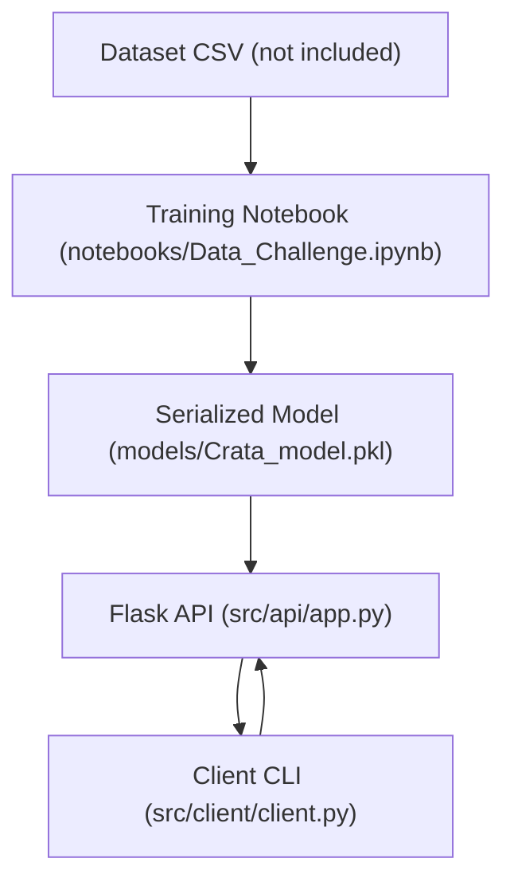

# Crata Sustainability Classifier


A text classification project that predicts whether a company is **sustainable (1)** or **not sustainable (0)** based on textual fields (e.g., `about`).

This repository includes:

- A training notebook with data cleaning and modeling experiments
- A saved scikit-learn pipeline (`joblib`)
- A minimal Flask API to serve predictions
- A Python client to query the API

## Approach (high level)

- Text preprocessing and cleaning
- TF-IDF vectorization
- Handling class imbalance using oversampling
- Model training and evaluation (Random Forest and Gradient Boosting)
- Persisting the best model pipeline as `Crata_model.pkl`

## Repository structure

```text
.
├── notebooks/
│   └── Data_Challenge.ipynb
├── models/
│   └── Crata_model.pkl
└── src/
    ├── api/
    │   └── app.py
    └── client/
        └── client.py
```
## Architecture



### Example API request

```bash
curl -X POST http://localhost:5000/predict \
     -H "Content-Type: application/json" \
     -d '{"text_description": "We build solar panels and renewable energy systems"}'
```
## Model Performance

Two ensemble models were evaluated: Random Forest and Gradient Boosting.

### Random Forest
- Accuracy: 0.86
- Precision (class 1): 0.66
- Recall (class 1): 0.32
- F1-score (class 1): 0.43

Although overall accuracy was high, recall for the minority class (sustainable companies) was relatively low.

### Gradient Boosting (Selected Model)
- Accuracy: 0.85
- Precision (class 1): 0.58
- Recall (class 1): 0.46
- F1-score (class 1): 0.51

Gradient Boosting achieved a better balance between precision and recall for the minority class,
which makes it more suitable for this imbalanced classification problem.

The model selection prioritizes minority class performance rather than overall accuracy.
## Architecture Overview

This project follows a simple but production-oriented structure:

1. **Training Layer (Notebook)**
   - Data cleaning and preprocessing
   - TF-IDF vectorization
   - Handling class imbalance
   - Model comparison and evaluation
   - Model serialization using joblib

2. **Model Artifact**
   - The trained scikit-learn pipeline is stored in `models/Crata_model.pkl`

3. **Serving Layer (Flask API)**
   - Exposes a `/predict` endpoint
   - Loads the serialized model at startup
   - Accepts text input via JSON
   - Returns classification result

4. **Client Layer**
   - Command-line interface
   - Supports single prediction or batch CSV input